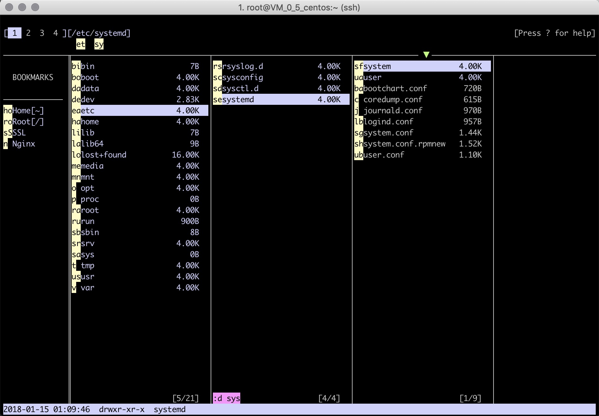

# fff

fff is a easy-to-use terminal file manager written in GO. 


## Features

* Cross platform: macOS, Linux, BSD(not tested), windows(todo) etc
* Multiple contexts(aka tabs). Up to 4,  use 1-4 key to switch through them
* Bookmark support
* Multiple directories show at mean time
* Jump to any file item you can see
* Filter file in multiple ways: by type, by modify time, by size, by name
* Customizable key bindings
* Spawn a sub shell in current directory
* Edit and preview text file
* Rename/Create files and directories
* Batch copy/move files/directories from any where you selected
* Copy with progress indicator


## Installation

As it still under development, there is no pre-build binary available.

You can build it from source:

```bash
go get -u github.com/jacokoo/fff
```


## Key bindings

```
Navigation:
      ↓, j    select next file                  ↑, k    select previous file                                                                                                                                
         J    select the last file                 K    select the first file
      →, l    open selected dir                 ←, h    close current dir
         f    filter files in current dir          F    clear filter
        ss    sort current dir by size            sm    sort current dir by modify time
        sn    sort current dir by name             g    refresh current dir
         d    toggle show file details             .    toggle show hidden files
         ,    remove the first opened dir     
         w    jump over all items displayed once   W    jump over all items displayed
         i    jump over the current dir once       I    jump over the current dir
1, 2, 3, 4    switch to corresponding context 
         ↵    open selected item use system default program
              ensure input (during input), cancel jump (during jump)
       esc    abort input (during input), cancel jump (during jump)
                                              
File:                                         
         m    toggle mark file                     u    toggle mark all items
         +    create new dir                       N    create new file
         R    rename selected file                 D    delete selected/marked items
         U    clear clips                          C    append selected/marked items to clip
         P    paste all cliped items to current dir
         M    move all cliped items to current dir
                                              
Bookmark:                                     
        bb    toggle show bookmark                bn    create bookmark
        bd    delete bookmark                 
        bw    jump over bookmark once             bW    jump over bookmark
                                              
Misc:                                         
 q, ctrl-q    Quit fff                             v    open selected file via pager
         !    start a shell in current dir         e    editor selected file
         ?    for help
```


# Tutorial

Once `fff` is installed, use `fff` to start `fff` with current directory, or use `fff PATH` to specify the working directory.

### Navigation

Use `h, j, k, l `or `←, ↓, ↑, →` to navigate item

Use `J` to select the last item, `K` to select the first item

Use `.` to toggle show hidden file, `d` to toggle show details

Use `g` to refresh the current directory

Use `Enter ↵` to open selected item via system default application


### Jump mode(aka ace jump)

Via jump mode, its able to jump to any items(file, directory, bookmark) displayed in the screen.



After enter jump mode, there are at most two characters will be displaed in the head of the item. Type these two characters could make the item selected.

**The first character is the heading charactor of the item**, the second one is generated alphabetically.

There are three type of jump mode

* Jump over all, use key `w` or `W`
* Only for bookmarks, use key `bw` or `bW`
* Only for current directory, use key `i` or `I`

Uppercase key is used for continuous jump: it won't stop until the last jump is  a file or an empty directory.


### Filter

Filter is used to filter items in the current directory.

Use `f` to start input filters. Multiple filter can be combined(logical `and`) by a space.

Use `F` to clear all filters.

There are four type of filter:

* By last modify time

  Filter start with `+` is a by mtime filter. Three time unit are supported: `h`hours, `d`days, `m`months

  e.g. :

  `+2m` means file is modified in recent 2 months

  `+10h` means file is modified in recent 10 hours

* By size

  Filter start with `<` or `>`is a by size filter. Three size unit are supported: `k`kibibyte, `m`Mebibyte, `g`Gibibyte

  e.g. :

  `>1g` means file size is greater then 1G

  `<10.2m `means file size is less then 10.2M 

* By type

  FIlter start with `:` is a by type filter. Only two type supported: `f` file, `d` directory

  e.g. :

  `:f` only show files

  `:d` only show directories

* By name

  Otherwise the filter is a by name filter. The name of the file or directory must contains the entire string of the filter

Multiple filter example:

`:f <1m +10d go` means the item must be a file and the size of it must less then 10M and it is modified in recent 10 days and the name of it must contains `go`.


### File operators

Use `R` to rename selected item

Use `+` to create new directory, use `N` to create new file

Use `m` to toggle mark item, use `u` to toggle mark all items in current directory

Use `D` to delete selected item or marked items

Use `C` to append selected item or marked items to clip for further use, use `U` to clear clip

Use `P` to paste clipped items to current directory and clear clip

Use `M` to move clipped items to current directory and clear clip


### Customize

All settings are placed in [config.yml](./config.yml), to override it, copy it to `~/.config/fff/config.yml` and change things according to the format.


## Roadmap

- [ ] Windows support

- [ ] Clip management: show clip list, delete

- [ ] Task management: show task details, cancel task

- [ ] Archive/Unarchive support(progress visible, cancelable)

- [ ] SSH/FTP integration

- [ ] HDFS integration(Maybe)

